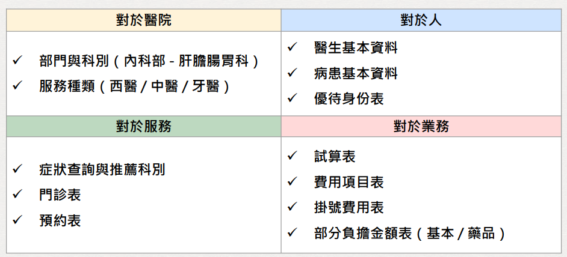
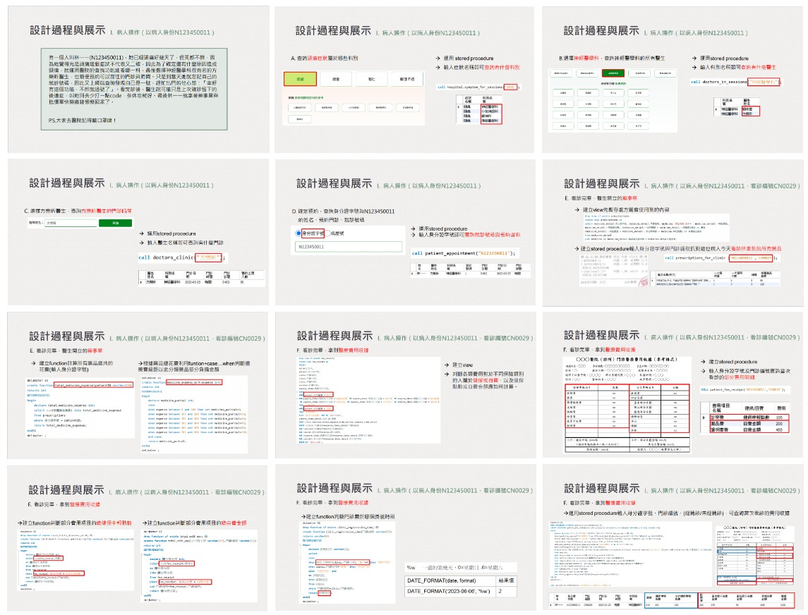
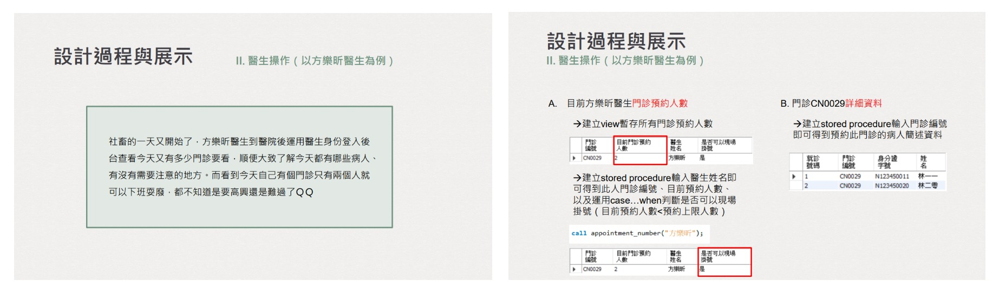

## 1112 資料庫管理 醫療系統專案

### 一、主題發想
I. 醫療健保資源是現今台灣引以為傲的全民福利，據統計顯示 110
年度(去年)，台灣每十萬人口中就有高達 92000 的國民有使用到
任何門診、住診包含急診等等的醫療資源，透過這高達 90%以上
的就診率，指出台灣對於醫療與人民的管理必須更加謹慎且有系
統的規劃，使資訊利用能徹底完善，省去不必要的手續及麻煩。

II. 起初我們希望能做到將傳統 only for 一家醫院的資料庫擴展到 for
多家醫院的雲端資料庫，使民眾能達到互通有無、搜尋篩選最適
合自己的就診醫院、科別、醫師，可因為法律、個資法、病患資
料…等制式規定，在實際生活中是不可取且無法實現的，因此我們
重新聚焦到 for 一家醫院的資料庫，並期望能為其提供多元功能
整合使用的資料庫。

### 二、希望解決之功能
利用正規化將醫療系統分為四大面向處理

     

 

### 三、系統架構圖 E-R Model
 
 

### 四、設計過程與展示

#### I. 病人操作
 

#### II. 醫生操作
 